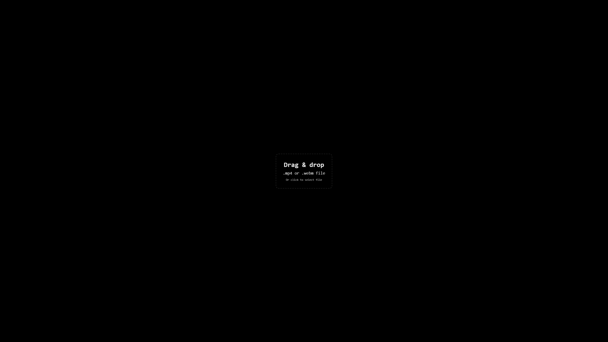

# Simple Tab Background

A minimalist Chrome extension that personalizes your new tab background with local images or videos.

**Tagline:** Change your new tab background with one image or video.

---

## Description
Simple Tab Background is a clean, lightweight extension that replaces your Chrome new tab background with any image or looping video you choose.  
It runs entirely offline — no uploads, no external servers, and no user tracking.

---

## Features
- Drag & drop or upload your own image or looping video (`.mp4`, `.webm`, `.jpg`, `.png`)  
- Local storage — your files never leave your computer  
- Minimal design with no distractions  
- `Shift + Right-Click` anywhere to reset the background  

<p align="center">
  
</p>

---

## Installation (Developer Mode)
1. Clone or download this repository.  
2. Open `chrome://extensions/` in Chrome.  
3. Enable **Developer Mode** (top-right corner).  
4. Click **Load unpacked** and select this folder.  
5. Open a new tab to see your custom background.

---

## Folder Structure
```plaintext
simple-tab-background/
│
├─ assets/
│   └─ welcome_page.png
├─ src/
│   ├─ background.js
│   ├─ newtab.html
│   └─ style.css
└─ manifest.json
